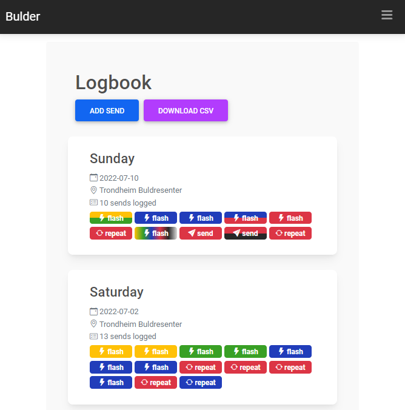
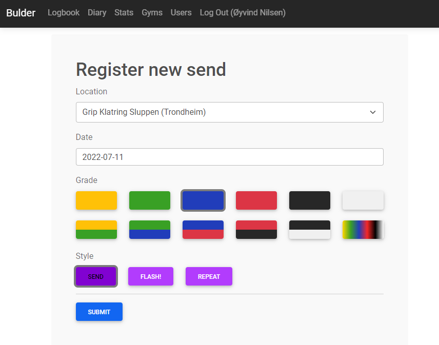
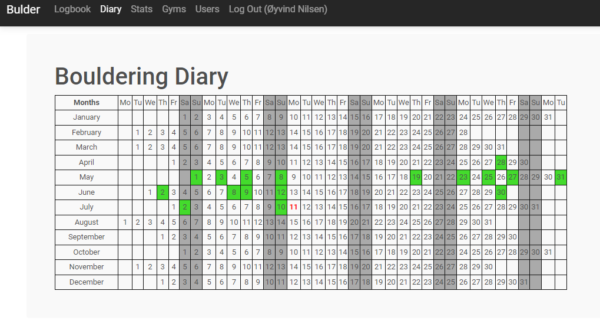
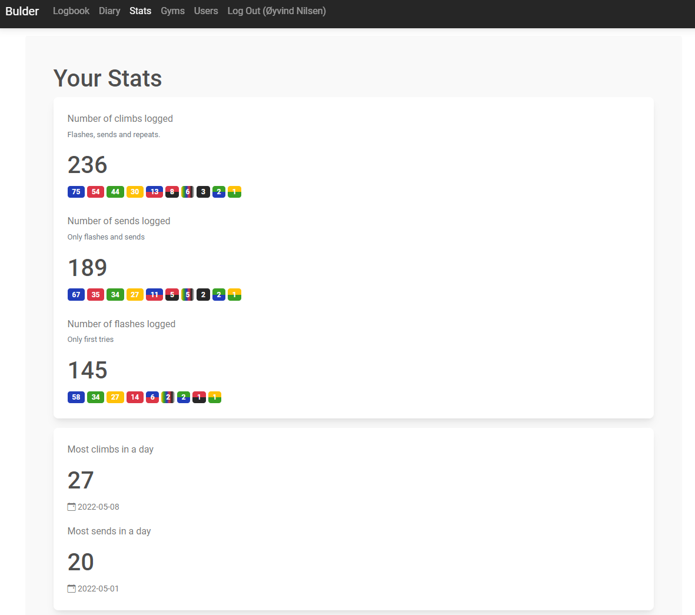

# bulder
Attempt to make app for logging your first ascent of boulders optimized for Trondheim (Norway) color graded indoor boulders.

## Components
Apache, PHP, MariaDB and Bootstrap.

### Containers
* php8.2:apache + mysqli
* mariadb

### External APIs
* Google Maps Places API.

## Screen shots
 
 
 
 

## Needs fixing
* change locale on calendar so weeks start on monday.
* restart policy in docker-compose.yml
* iso dates shold be replaced with nicer dates, maybe locale js stuff.
* favicon?
* add send buttons should be fetched from db to make it possible to change grading systems in the future.
* users.php should have edit/delete?
* sends: terrain: slab/vert/overhang (?).
